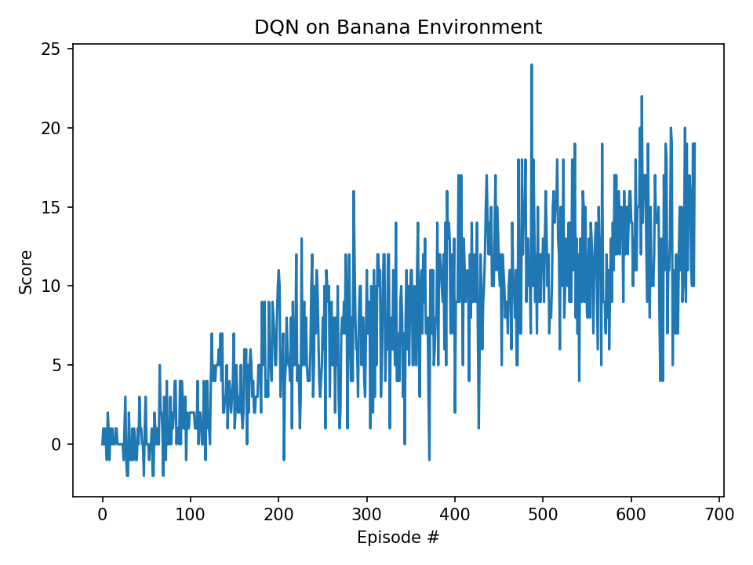

# Report: Project 1 – Navigation (DQN with Banana Environment)

## Learning Algorithm

We implemented a Deep Q-Network (DQN) agent based on the Nature paper by Mnih et al. (2015).  
Key elements of the algorithm:

- **Replay buffer**: a memory of past experiences, sampled randomly to break temporal correlations.
- **Target network**: a periodically updated copy of the Q-network for stable bootstrapping.
- **ε-greedy exploration**: selects random actions with probability ε, decayed over time.
- **Huber-style loss**: TD error is clipped to stabilize training.
- **Optimizer**: RMSProp with α=0.95 and eps=1e-5, as in the original DQN paper.

### Hyperparameters
- Discount factor γ = 0.99  
- Learning rate = 6.25e-4 (RMSProp)  
- Batch size = 64  
- Replay buffer size = 100,000  
- Target network update frequency = every 1,000 gradient steps  
- ε: start=1.0, end=0.01, decay=0.995  
- Update frequency = every environment step  
- Hidden layers = (128, 128) fully connected  

### Model Architecture
- Input: 37-dimensional state vector  
- Fully connected network with two hidden layers of 128 units each (ReLU activations)  
- Output: 4 Q-values, one for each discrete action (forward, backward, left, right)  

---

## Results

The agent is considered successful when it achieves an average reward of **+13 over 100 consecutive episodes**.  

Our agent solved the environment in **673 episodes**, with a moving average score of **13.05**.  
This is significantly below the 1800 episode threshold required for passing.  

The figure above shows the reward per episode. The curve climbs steadily and crosses the solution threshold around episode 673.

---

## Ideas for Future Work

Several improvements could further enhance performance and training stability:

1. **Double DQN** – Mitigates Q-value overestimation by decoupling action selection and evaluation.  
2. **Dueling Networks** – Splits the network into value and advantage streams for more robust learning.  
3. **Prioritized Experience Replay** – Samples more informative transitions (with large TD error) more often.  
4. **Noisy Networks / Parameter Noise** – Explore better strategies for exploration beyond ε-greedy.  
5. **Distributional DQN** – Model the full distribution of returns instead of only the mean.  

---

## Conclusion

We successfully implemented and trained a DQN agent in the Unity Banana environment.  
The agent solved the task in 673 episodes, demonstrating that the DQN approach is effective for navigation in this discrete-action setting.

---

## References

- Mnih, V. et al. (2015). *Human-level control through deep reinforcement learning*. Nature, 518(7540), 529–533.  
- Udacity Deep Reinforcement Learning Nanodegree materials.

