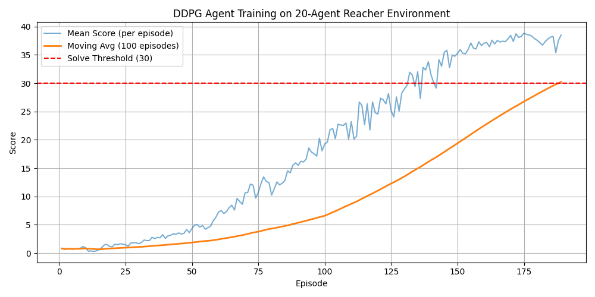

# Udacity Deep Reinforcement Learning - Project 2: Continuous Control

## 1. Environment
We solved the **20-Agent Reacher environment**.  
- Each agent has a 33-dimensional continuous state space.  
- Actions are 4-dimensional continuous values in [-1, 1].  
- Reward: +0.1 for each step the agent keeps its arm in the goal location.  
- The task is solved when the **average score across agents is ≥ 30 over 100 consecutive episodes**.

## 2. Learning Algorithm
We implemented **DDPG (Deep Deterministic Policy Gradient)** with:
- Actor-Critic architecture
- Replay buffer of size 1e6
- Batch size = 256
- Actor LR = 1e-4, Critic LR = 1e-3, weight decay = 1e-2
- Ornstein–Uhlenbeck noise with decaying scale
- Soft target updates (τ = 1e-3)
- Running state normalization
- TD3-lite tricks: target policy smoothing and noise clipping

## 3. Results
The agent solved the environment in **189 episodes**:  
- Final Avg(100) = 30.22  
- Mean episode scores peaked above 30.  

## 4. Files
- `train_20.py`: training script
- `ddpg_agent.py`: agent implementation
- `model.py`: neural network architectures
- `final_actor.pth`, `final_critic.pth`: saved trained weights
- `training_log_20.csv`: episode logs
- `training_curve.png`: performance plot

## 5. Future Work
- Experiment with TD3 and SAC for even faster convergence.  
- Try PER (Prioritized Experience Replay).  
- Transfer these methods to financial time-series data.
